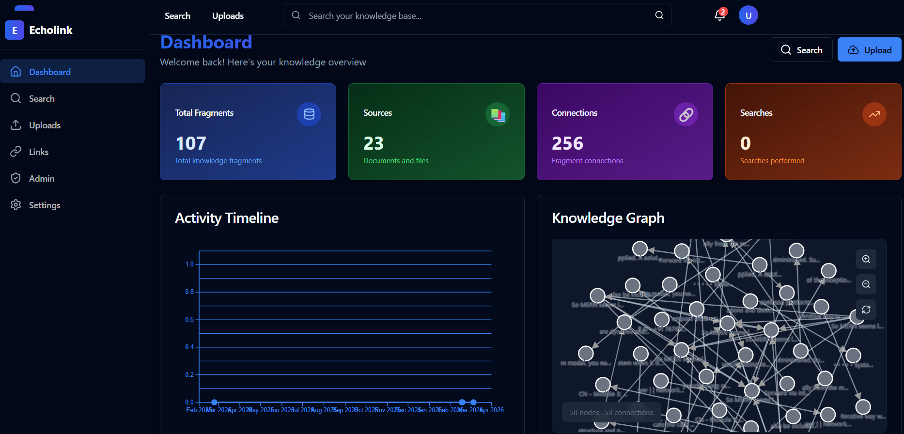
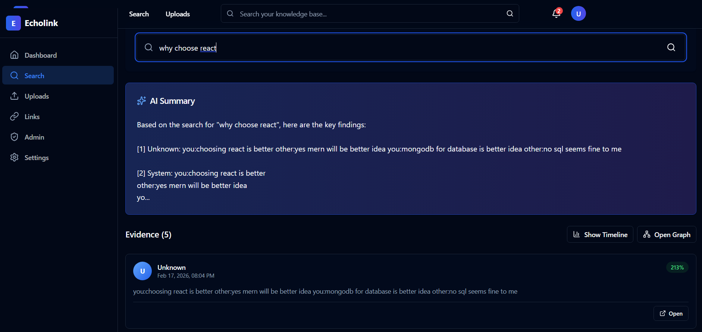
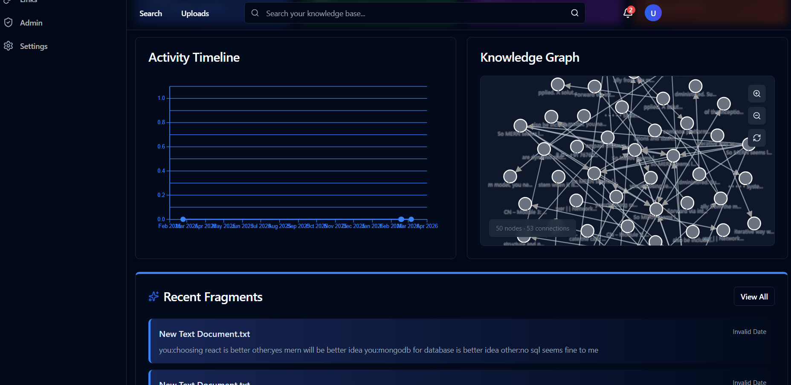
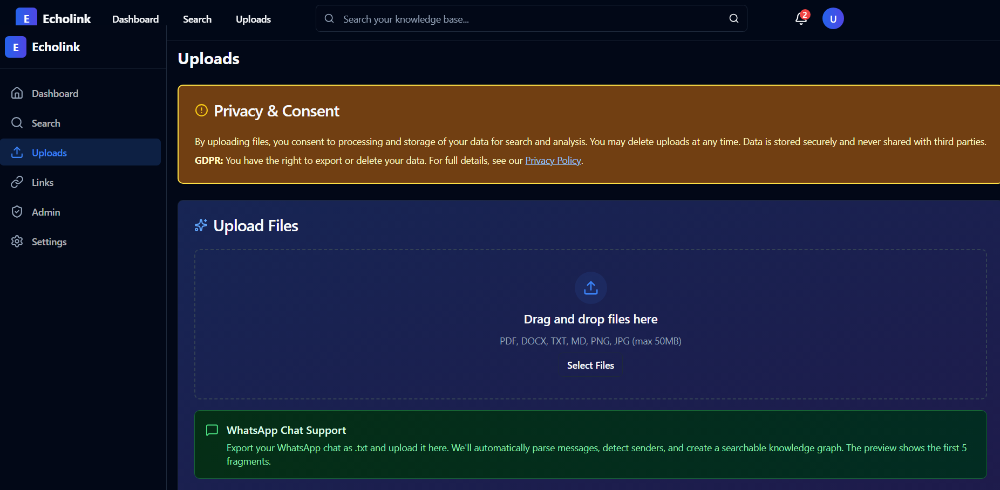

# EchoLink — Privacy-First Knowledge Graph

<div align="center">


**A full-stack MERN + Python application for building your personal knowledge graph**

[](LICENSE)
[](CONTRIBUTING.md)
[]()

[Features](#features) • [Quick Start](#quick-start) • [Documentation](#documentation) • [Demo](#demo)

</div>

---

## 🎯 Overview


## ✨ Features

### Core Functionality

- **Multi-Format Upload**
  - WhatsApp chat exports (.txt)
  - PDFs and DOCX documents
  - Images with OCR support
  - Plain text and markdown
  
- **Intelligent Indexing**
  - Local sentence-transformers (all-MiniLM-L6-v2)
  -  384-dimensional embeddings
  - FAISS vector storage
  - Automatic metadata extraction

- **Semantic Search**
  - Natural language queries
  - Relevance scoring
  - Context-aware results
  - Evidence highlighting

- **Knowledge Graph**
  - Auto-generated connections
  - 8 relation types (same_topic, followup, supports, contradicts, etc.)
  - Interactive D3 visualization
  - Graph traversal and exploration

- **Timeline View**
  - Chronological fragment display
  - Activity charts
  - Date-based filtering

### Advanced Features

- **Admin Dashboard**
  - System statistics
  - Reindex and rebuild tools
  - Data management
  - Worker monitoring

- **AI Summarization**
  - GPT-3.5 integration (optional)
  - Local fallback summaries
  - Key point extraction

- **Privacy & Security**
  - JWT authentication
  - Password hashing (bcrypt)
  - Rate limiting
  - File size validation
  - Data export/deletion

---

## 🚀 Quick Start

### Prerequisites

- **Node.js** 18+ and npm
- **Python** 3.10+
- **MongoDB** (local or Atlas)
- **Git**

### Installation

1. **Clone the repository**

```bash
git clone https://github.com/yourusername/echolink.git
cd echolink
```

2. **Set up the backend**

```bash
cd backend
npm install
cp .env.example .env
# Edit .env with your MongoDB URI and other settings
```

3. **Set up the frontend**

```bash
cd ../frontend
npm install
cp .env.example .env
# Edit .env if needed (defaults to localhost:3001)
```

4. **Set up the embedding service**

```bash
cd ../embed_service
python -m venv venv
# Windows
venv\Scripts\activate
# macOS/Linux
source venv/bin/activate

pip install -r requirements.txt
```

5. **Start all services**

**Windows (PowerShell):**
```powershell
.\start-all.ps1
```

**Manual start (any OS):**
```bash
# Terminal 1: Embedding Service (CRITICAL: Must run first)
cd embed_service
# Activate venv if you have one, or just run:
python app.py

# Terminal 2: Backend
cd backend
npm start

# Terminal 3: Frontend
cd frontend
npm run dev
```

6. **Access the application**

Open your browser and navigate to:
- Frontend: http://localhost:3000
- Backend API: http://localhost:3001/api
- Embedding Service: http://localhost:5000

---

## 📖 Documentation

### Environment Variables

#### Backend (.env)
```env
# Database
MONGODB_URI=mongodb://localhost:27017/echolink

# JWT
JWT_SECRET=your-super-secret-jwt-key-change-this
JWT_EXPIRATION=7d
JWT_REFRESH_EXPIRATION=30d

# Server
PORT=3001
NODE_ENV=development
FRONTEND_URL=http://localhost:3000

# Services
EMBEDDING_SERVICE_URL=http://localhost:5000

# Optional: OpenAI for better summaries
OPENAI_API_KEY=sk-your-openai-api-key

# Optional: Email (for verification/reset)
SMTP_HOST=smtp.gmail.com
SMTP_PORT=587
SMTP_USER=your-email@gmail.com
SMTP_PASS=your-app-password
```

#### Frontend (.env)
```env
VITE_API_URL=http://localhost:3001/api
```

#### Embedding Service (.env)
```env
MODEL_NAME=sentence-transformers/all-MiniLM-L6-v2
HOST=127.0.0.1
PORT=5000
HF_CACHE_DIR=./hf_cache
VECTOR_STORE_DIR=./vectorstore
EMBED_BATCH_SIZE=32
```

### API Documentation

#### Auth Endpoints
```
POST   /api/auth/register          Register new user
POST   /api/auth/login             Login and get tokens
POST   /api/auth/logout            Logout
POST   /api/auth/refresh-tokens    Refresh access token
POST   /api/auth/request-verify-email   Request email verification
POST   /api/auth/verify-email      Verify email with token
POST   /api/auth/request-password-reset Request password reset
POST   /api/auth/reset-password    Reset password with token
```

#### Upload Endpoints
```
POST   /api/import/upload          Upload file (PDF, DOCX, TXT, images)
POST   /api/import/text            Upload plain text
POST   /api/import/whatsApp        Upload WhatsApp chat export
GET    /api/import/sources         Get all uploaded sources
GET    /api/import/sources/:id     Get source details
DELETE /api/import/sources/:id     Delete source
POST   /api/import/sources/:id/reprocess Reprocess source
POST   /api/import/sources/:id/index     Manually index source
```

#### Query Endpoints
```
POST   /api/query                  Search with semantic query
GET    /api/query/history          Get query history
GET    /api/query/fragments/:id    Get fragment details
```

#### Link Endpoints
```
POST   /api/links                  Create manual link
GET    /api/links/fragments/:id    Get links for fragment
GET    /api/links/fragments/:id/suggestions Get suggested links
PATCH  /api/links/:id              Update link
DELETE /api/links/:id              Delete link
POST   /api/links/rebuild          Rebuild all links
```

#### Fragment Endpoints
```
GET    /api/fragments              Get all fragments (paginated)
PATCH  /api/fragments/:id          Update fragment
DELETE /api/fragments/:id          Delete fragment
GET    /api/status                 Get system status
GET    /api/graph                  Get knowledge graph data
GET    /api/timeline               Get timeline data
```

#### Admin Endpoints
```
GET    /api/admin/status           Get comprehensive system status
POST   /api/admin/reindex-all      Reindex all sources
DELETE /api/admin/purge-old        Purge old data
GET    /api/admin/logs             View system logs
GET    /api/admin/workers/status   Check worker status
```

---

## 🧪 Testing

### Run Backend Tests
```bash
cd backend
npm test
```

### Run Integration Tests
```bash
cd backend
npm run test:integration
```

### Manual Testing Flow
1. Register a new account at http://localhost:3000/register
2. Upload the sample file: `sample_whatsapp.txt`
3. Wait for status to show "Processed" and "Indexed"
4. Navigate to Search and enter a query (e.g., "React")
5. Verify results appear with evidence cards
6. Check the graph visualization shows connections
7. View the timeline for chronological data

---

## 🏗️ Architecture

```
EchoLink/
├── backend/                 # Node.js + Express API
│   ├── src/
│   │   ├── controllers/    # Request handlers
│   │   ├── models/         # MongoDB schemas
│   │   ├── routes/         # API endpoints
│   │   ├── services/       # Business logic
│   │   ├── middleware/     # Auth, validation, etc.
│   │   ├── workers/        # Background jobs
│   │   └── utils/          # Helper functions
│   ├── tests/              # Jest tests
│   └── server.js           # Entry point
│
├── frontend/                # React + Vite app
│   ├── src/
│   │   ├── pages/          # Route pages
│   │   ├── components/     # Reusable UI components
│   │   ├── services/       # API clients
│   │   ├── context/        # React context
│   │   └── lib/            # Utilities
│   └── public/             # Static assets
│
├── embed_service/           # Python embedding service
│   ├── app.py              # Flask API
│   ├── vectorstore/        # FAISS index storage
│   └── hf_cache/           # Model cache
│
├── docs/                    # Additional documentation
├── tests/                   # E2E tests
└── sample_data/             # Sample files for testing
```

### Technology Stack

**Backend:**
- Node.js + Express.js
- MongoDB + Mongoose
- JWT authentication
- Multer (file uploads)
- pdf-parse, mammoth, tesseract.js

**Frontend:**
- React 18
- Vite
- React Router v6
- TailwindCSS + shadcn/ui
- Framer Motion
- D3.js + Recharts
- React Query

**Embedding Service:**
- Python + Flask
- sentence-transformers
- FAISS vector database
- NumPy

---

## 🎨 Screenshots

 

| Dashboard | Search |
|----------|--------|
|  |  |

| Graph | Upload |
|------|--------|
|  |  |

---

## 🔧 Configuration

### Customize Embedding Model

Edit `embed_service/.env`:
```env
# Options: any sentence-transformers model
MODEL_NAME=sentence-transformers/all-MiniLM-L6-v2
# Or: sentence-transformers/paraphrase-multilingual-MiniLM-L12-v2
# Or: sentence-transformers/all-mpnet-base-v2
```

### Adjust Link Building Sensitivity

Edit `backend/src/workers/link.worker.js`:
```javascript
const MIN_SIMILARITY_SCORE = 0.7; // Lower = more links, Higher = fewer links
```

### Configure Rate Limits

Edit `backend/src/middleware/rateLimit.js`:
```javascript
const uploadRateLimit = userRateLimit({ 
  windowMs: 10 * 60 * 1000,  // Time window
  max: 10                     // Max requests per window
});
```

---

## 🐛 Troubleshooting

### MongoDB Connection Issues
```bash
# Check if MongoDB is running
mongosh

# Or use MongoDB Atlas (cloud)
# Update MONGODB_URI in backend/.env
```

### Embedding Service Won't Start
```bash
# Check Python version
python --version  # Should be 3.10+

# Reinstall dependencies
pip install --upgrade -r requirements.txt

# Check if port 5000 is free
netstat -ano | findstr :5000  # Windows
lsof -i :5000                 # macOS/Linux
```

### Frontend Build Errors
```bash
# Clear cache and reinstall
cd frontend
rm -rf node_modules package-lock.json
npm install

# Check Node version
node -v  # Should be 18+
```

### OCR Not Working
```bash
# Tesseract.js is included
# For better performance, install native Tesseract:
# Windows: https://github.com/UB-Mannheim/tesseract/wiki
# macOS: brew install tesseract
# Linux: sudo apt-get install tesseract-ocr
```

---

## 📝 License

This project is licensed under the MIT License - see the [LICENSE](LICENSE) file for details.

---

## 🤝 Contributing

Contributions are welcome! Please read our [Contributing Guide](CONTRIBUTING.md) for details on our code of conduct and the process for submitting pull requests.

---

## 🙏 Acknowledgments

- [sentence-transformers](https://www.sbert.net/) for embeddings
- [FAISS](https://github.com/facebookresearch/faiss) for vector search
- [shadcn/ui](https://ui.shadcn.com/) for UI components
- [D3.js](https://d3js.org/) for graph visualization
- All open-source contributors

---

## 📞 Support

- 📧 Email: support@echolink.app
- 🐛 Issues: [GitHub Issues](https://github.com/yourusername/echolink/issues)
- 💬 Discussions: [GitHub Discussions](https://github.com/yourusername/echolink/discussions)
- 📚 Docs: [Full Documentation](https://docs.echolink.app)

---

<div align="center">

**Built with ❤️ for knowledge seekers everywhere**

[⬆ Back to Top](#echolink--privacy-first-knowledge-graph)

</div>
